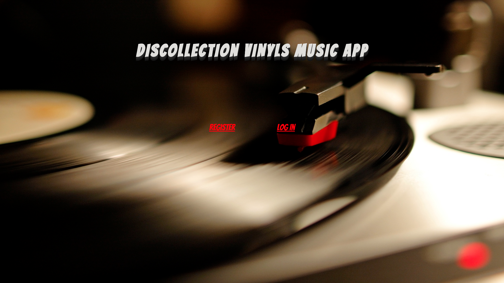
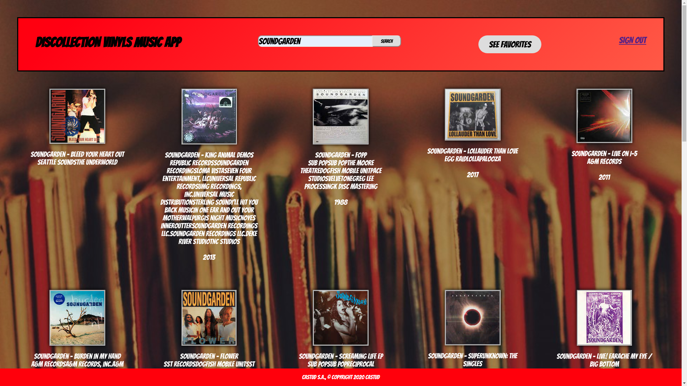
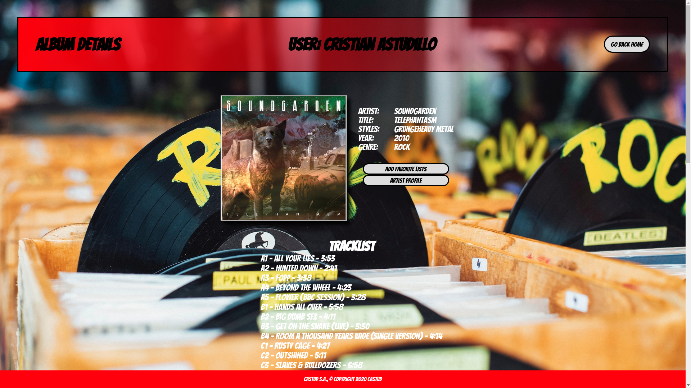
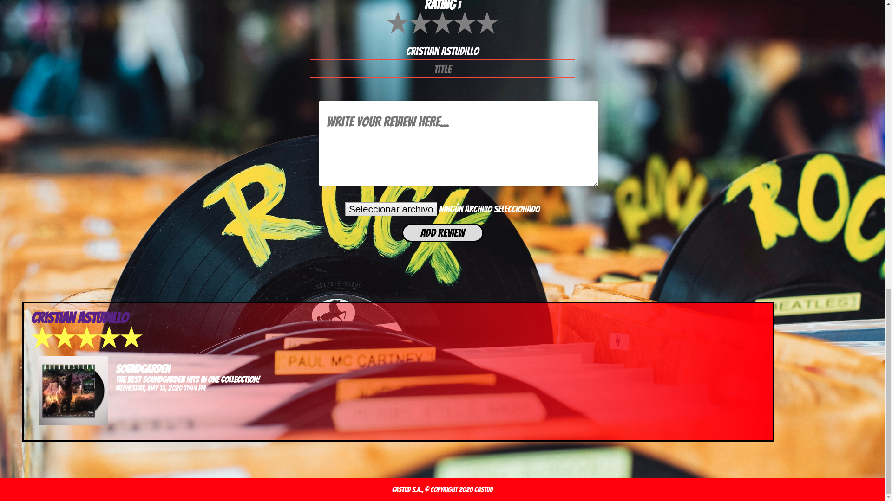
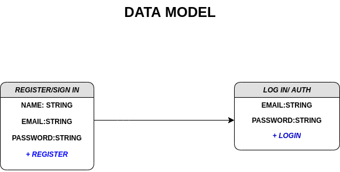
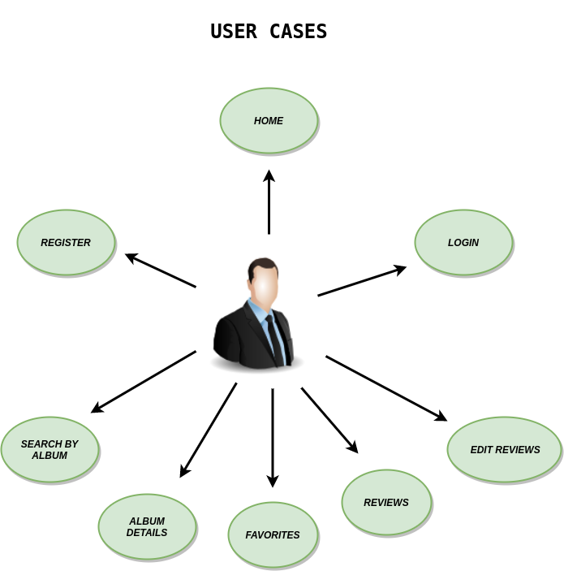
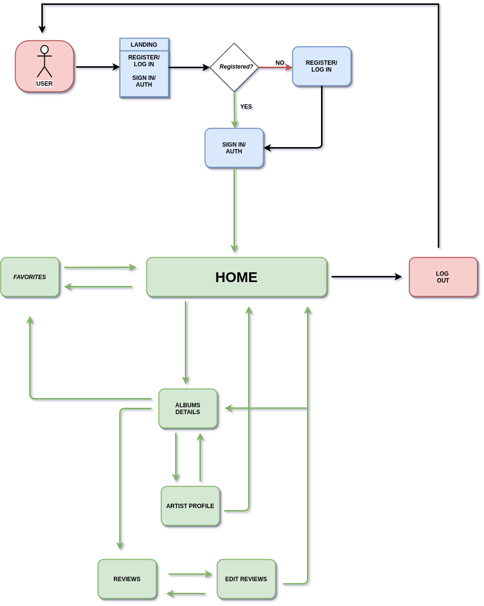

# DISCOLLECTION VINYLS MUSIC APP

Hosting URL: https://test-3fd42.web.app

## Find your favorite artist in vinyl format

If you are looking for your favorite artist in vinyl format, this is your application, you can search by artist, viewing the list of songs, biography, to leave a comment on a particular album.  

## Functional Description

The functionality of this application will be related to the world of music, especially focused on the world of vinyl...
The user, when starting the app, sign up in a quite simple way and then log in. At the initial session, the user will start the home page, visualizing vinyl covers with the title, record label release year, besides paging in a simple way; he will also be able to make a search of his favorite artist and visualize his favorites.  In any of the cases, the user will be able to see the album details by clicking on the album title (artist name, title, styles, year, tracklist).  Within the album details, the user will have the possibility to make a review, add/delete favorites, and update them in real time. 
  

## DESIGN(SCREENSHOTS)

   

**HOME : With the user already authenticated, the following is that he will be able to make searches according to his musical interest**.

- ***Artist:*** Matches by artist name(query/search).
- ***Pages:***  Albums per page.
- ***Album:*** details(Link).

   

  **ALBUM DETAILS: When the user is interested in a specific album, can enter following with link to see album details, add favorite list, see artist profile and write a review:**

   

**REVIEW**: The own user can write some reviews...

  

## DATA MODEL

   

## USER CASES
​
   

## DIAGRAM FLOW

   

## TECHNOLOGIES

| TRANSVERSAL | SERVER SIDE | CLIENT SIDE | TESTING |
| ----------- | ----------- | ----------- | ------- |
| HTML        | FireBase    | React       | Jest    |
| JavaScript  |             | Redux       |         |
|             |             | CSS         |         |
|             |             | Sass        |         |

## Development Info

- Discogs API music: https://www.discogs.com/developers/#

## NEXT VERSION
- ***Owner contact(Link):*** In this sub-page, the user will be able to contact direct way with the owner:
 - ***Owner review***: The owner makes a short, but precise personal presentation and what he would like to do with the product (sell, exchange, come to an agreement, etc...).
 - ***Chat***: Contact with the owner chatting a message.
 - ***E-mail***: Contact with the owner with a e-mail.